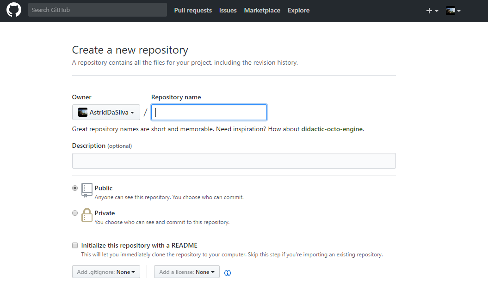
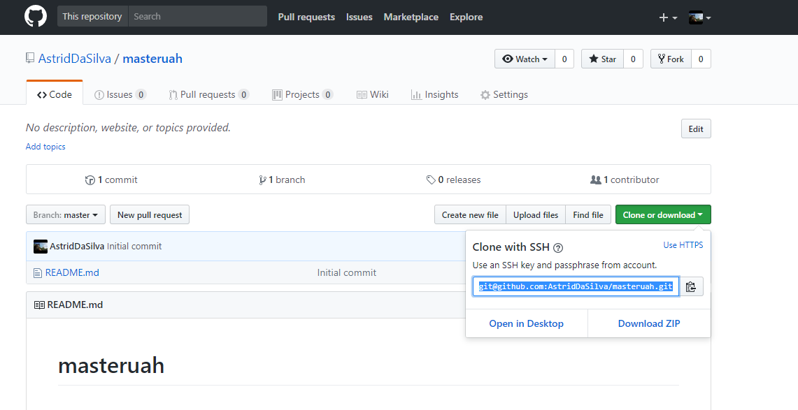
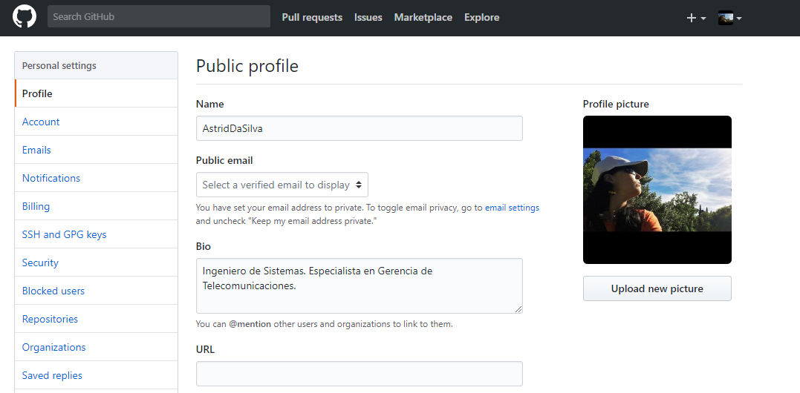
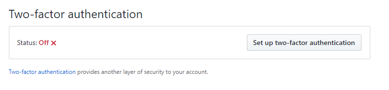
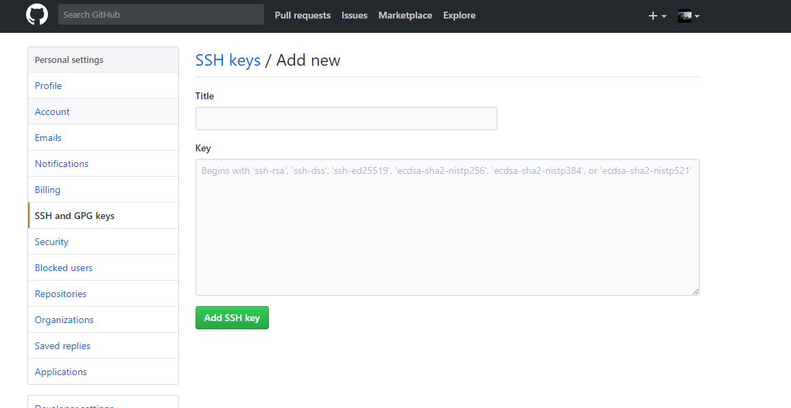
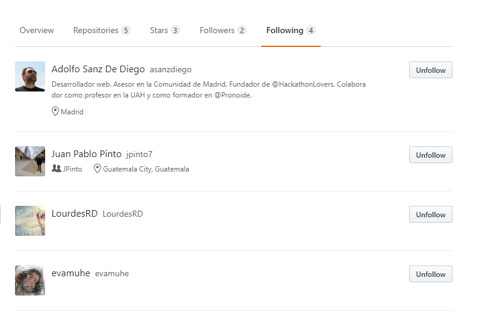
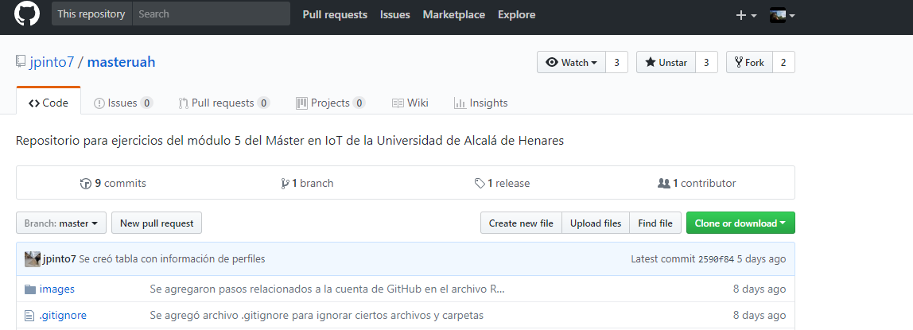
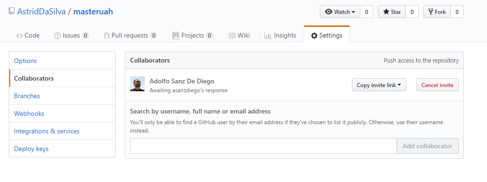

### masteruah

###### **Enunciado ejercicios básicos de Git, GitHub y Markdown**
### **Configuración Git**

Establecer el nombre y el correo del usuario. 

**Git siempre usará esta información para todo lo que se haga en el sistema _(es importante al realizarlos commits)_**
 
git config --global user.name "Nombre usuario"
git config --global user.email ejemplo@example.com
	
	git config --global core.editor vi
		:Si se quiere configura el editor
	git config --list
		:Para comprobar la configuración de usuario, y todas las propiedades que Git ha configurado
	git help config
		:Para consultar la ayuda de Git		
		
### **Crear un repositorio en GitHub**

Crear un repositorio en vuestro GitHub llamado masteruah.

 
	
### **Generar SSH**

	1. ssh-keygen -t rsa -C "astriddasilva1116@gmail.com"
	2. cat ~/.ssh/id_rsa.pub
	3. ssh -T git@github.com
	
### **Clonar vuestro repositorio en local**
		
	git clone remote_location clone_name
	git clone git@github.com:AstridDaSilva/masteruah.git

 
		
### **README**

Crear en el repositorio local un documento:

	_README.md_
		
		 En este documento se encuentran los comandos que se han utilizado durante todos los ejercicios y 
		 las explicaciones y capturas de pantalla que se han considerado necesarias.

### **Commit inicial**

Añadir al README.md los comandos utilizados hasta ahora y hacer un commit inicial  con el mensaje commit inicial.
	
	git commit -m "Commit inicial"

### **Push inicial**
	
Subir los cambios al repositorio remoto.
		
Para ver los repositorios remotos:
		
	git remote -v 
			
Publicar los cambios:
			
	git push origin master

### **Ignorar archivos

Añadir al README.md los comandos utilizados hasta ahora y hacer un commit inicial  con el mensaje commit inicial.
		
	git add README.md
			
Crear en el repositorio local un fichero llamado privado.txt.
		
vi privado.txt
git add privado.txt
			
Crear en el repositorio local una carpeta llamada privada.
		
	vi privada
	git add privada
	git commit -m "Añadir archivo"
	
Realizar los cambios oportunos para que tanto el archivo como la carpeta sean ignorados por git.
		
	git status

### **Añadir fichero 1.txt**

Añadir fichero 1.txt al repositorio local.
			
	vi 1.txt
	git add privado.txt
		
### **Crear el tag v0.1**

Crear un tag v0.1.
	
	git tag -a v0.1 -m "Versión 0.1"
	git tag
	
	git tag v0.1

Subir el tag v0.1

	git push origin master --tags
	git push origin v0.1
	
	git push --tag origin master

###**Cuenta de GitHub**

	Poner una foto en vuestro perfil de GitHub.
	Poner el doble factor de autentificación en vuestra cuenta de GitHub.
	Añadir la clave pública que se corresponde a tu ordenador.
	

	
### **Uso social de GitHub**

Preguntar los nombres de usuario de GitHub de tus compañeros de clase, búscalos, y  sigueles.
Seguir los repositorios masteruah del resto de tus compañeros.
Añadir una estrella a los repositorios masteruah del resto de tus compañeros.

### **Crear una tabla**

Crear una tabla de este estilo en el fichero README.md con la información de varios de tus compañeros de clase:

## **NOMBRE GITHUB**

Nombre del compañero 1 enlace a github 1
Nombre del compañero 2 enlace a github 1
Nombre del compañero 3 enlace a github 3

|     Compañero     |                Enlace Github                   |
| ----------------  | ---------------------------------------------- |
|  Juan Pablo Pinto |<https://github.com/jpinto7>                    | 
|    José Manuel    |<https://github.com/jomarequena?tab=following>  |
|    Adolfo Sanz    |<https://github.com/asanzdiego>                 |

### **Colaboradores**

	Poner a **github.com/asanzdiego** como colaborador del repositorio masteruah.

### Ejercicios avanzados

### Ramas

Crear una rama

	git branch v0.2
	git branch
	
Posicionarse en esa rama
	
	git checkout v0.2

### Añadir archivo 2.txt

	vi 2.txt
	git add .
	git commit -m "Añadir archivo 2.txt"

### Crear rama remota v0.2

	git push origin v0.2

	

### Merge directo

Posicionarse en la rama master.
	
	git checkout master
	
Hacer un merge de la rama v0.2 en la rama master.

	git merge v0.2 -m "merge v0.2 sin conflictos"

### Merge con conflicto
	
En la rama master poner Hola en el fichero 1.txt y hacer commit.
	
	git checkout master
	echo "Hola" >> 1.txt
	git add .
	git commit -m "hola en 1.txt"

Posicionarse en la rama v0.2 y poner Adios en el fichero "1.txt" y hacer commit.
	git checkout v0.2	
	echo "Adios" >> 1.txt
	git add .	

